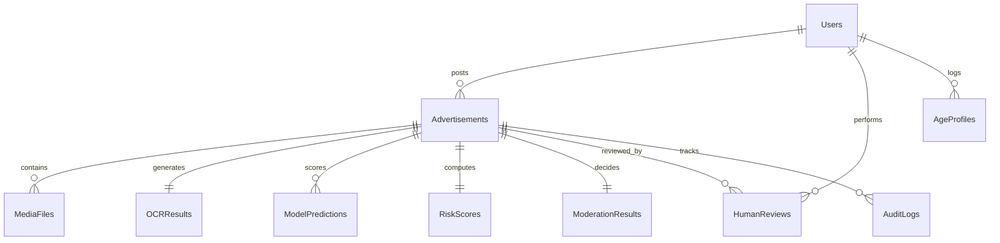

# SafeAd AI: Trust & Safety Content Moderation Framework

SafeAd AI is a unified trust and safety framework designed for early detection of harmful advertisements and age-aware content delivery on social media short-video platforms (reels).

---

## 🏗️ 1. System Architecture & Workflow

The system is designed with a decoupled processing layer to handle multimodal inputs:

```
[Ad Video/Image Upload] ──> [Ingestion & Processing]
                                  │
      ┌───────────────────────────┼───────────────────────────┐
      ▼                           ▼                           ▼
[Keyframe Sampling]         [pytesseract OCR]         [ASR Audio Transcript]
(OpenCV uniform split)      (Text extraction)         (Speech-to-Text parsing)
      │                           │                           │
      └───────────────────────────┼───────────────────────────┘
                                  ▼
                    [Multilingual Keyword Engine]
                 (English, Hindi/Hinglish, Malayalam/Manglish)
                                  │
                                  ▼
                   [Fused Multimodal Risk Score]
              (Visual 40%, OCR/NLP 30%, Speech 30%)
                                  │
                                  ▼
                     [Ad Decision Policy Check]
       ┌──────────────────────────┼──────────────────────────┐
       ▼                          ▼                          ▼
  Score < 35                  35 <= Score <= 75             Score > 75
[Auto-Approve]              [Human Review Queue]          [Auto-Reject]
```

---

## 📊 2. Database Schema (ER Diagram)

The SQLite database (`safead.db`) is mapped with the following entity relationships:



### Table Mapping:
1.  **`Users`**: Holds system accounts (advertiser, administrator, social_user).
2.  **`Advertisements`**: Stores uploaded ad details, file path location, and safety status.
3.  **`MediaFiles`**: Logs creative specs (dimensions, frame rate, duration).
4.  **`OCRResults`**: Stores raw text scanned from keyframes.
5.  **`PolicyRules`**: Catalog of violation policies (Adult Content, Child Safety, Gambling, etc.) with min age limits.
6.  **`ModelPredictions`**: Modality-specific predictions (visual, OCR, speech classifier scores).
7.  **`RiskScores`**: Fused 0-100 values combining visual, text, and voice layers.
8.  **`AgeProfiles`**: Tracks classifications (Child vs. Not a Child) based on face/behavior.
9.  **`HumanReviews`**: Holds decisions from manual queue overrides.
10. **`AuditLogs`**: Maintains tamper-evident history of all AI and human decisions.

---

## 🛠️ 3. Setup & Execution Instructions

### Prerequisites
Make sure Python 3.10+ and standard tools are installed. In this environment, run:
```bash
pip install streamlit opencv-python scikit-learn pandas numpy pillow
```

### Running the Web Application
Launch the Streamlit interactive dashboard from the workspace directory:
```bash
streamlit run safead_system/app.py
```
This launches a browser interface containing:
*   **Advertiser Portal**: Test ad submission and view explanation metrics.
*   **Admin Dashboard**: Manage pending manual overrides and customize security rules.
*   **Social User Feed**: Test real-time age-aware delivery (filters ads for underage users, replacing them with GK reels).

### Running automated Tests
To evaluate pipeline performance metrics (Accuracy, F1-Score, Confusion Matrix, and Ablation Study):
```bash
python -m safead_system.test_suite
```
