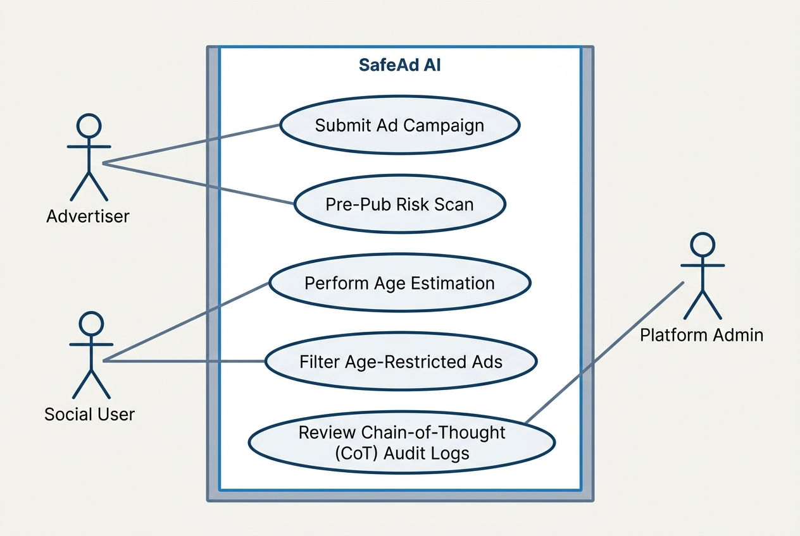
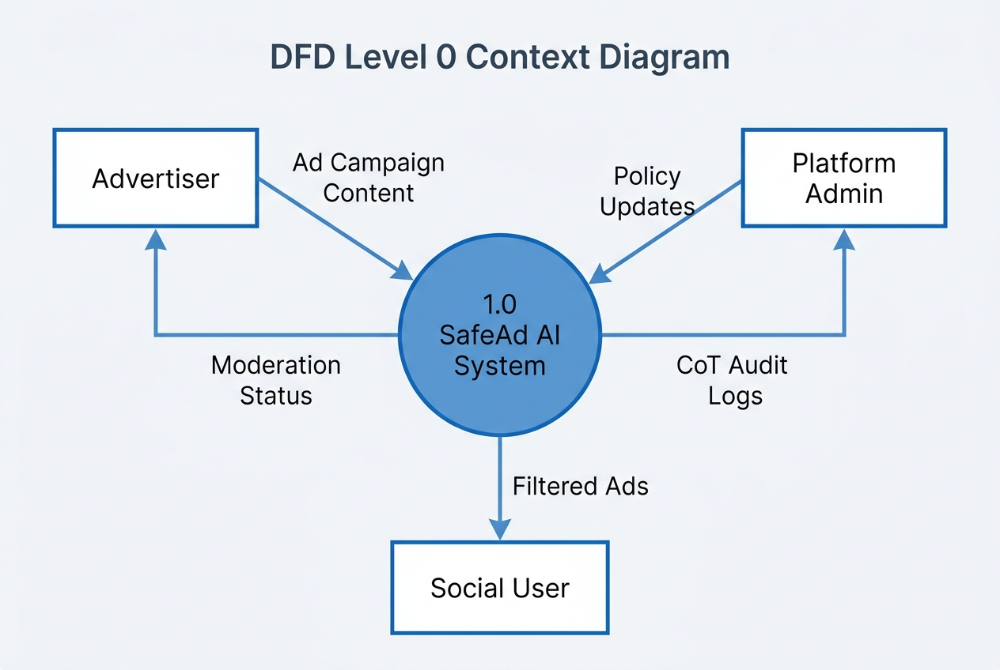
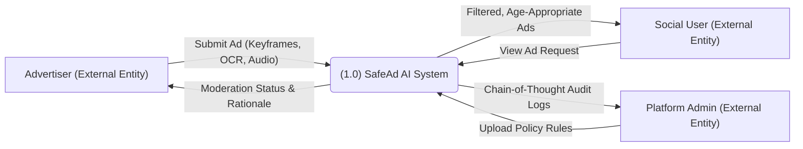
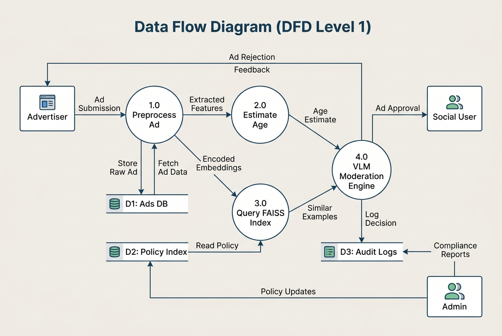
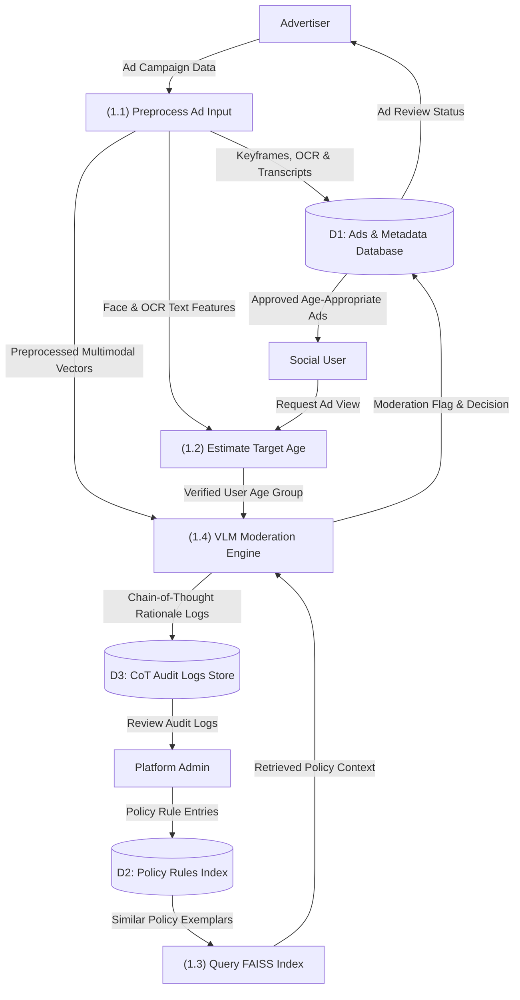
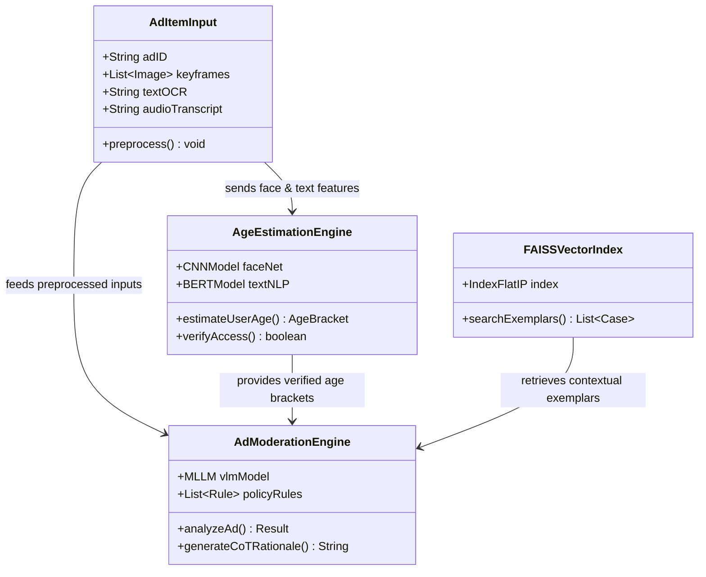

# SafeAd AI: System Design Diagrams

This document compiles the architectural flow, class structures, UML use cases, and Data Flow Diagrams (DFDs) for the **SafeAd AI** content safety engine.

---

## 👥 SafeAd AI UML Use Case Diagram



### Interactive Mermaid Use Case representation:

```mermaid
usecaseDiagram
    actor Advertiser as "Advertiser"
    actor SocialUser as "Social User"
    actor Admin as "Platform Admin"
    
    rectangle "SafeAd AI System Boundary" {
        usecase UC1 as "Submit Ad Campaign"
        usecase UC2 as "Pre-Pub Risk Scan"
        usecase UC3 as "Perform Age Estimation"
        usecase UC4 as "Filter Age-Restricted Ads"
        usecase UC5 as "Review CoT Audit Logs"
    }
    
    Advertiser --> UC1
    
    SocialUser --> UC4
    
    Admin --> UC2
    Admin --> UC4
    Admin --> UC5
    
    %% Relationships between internal use cases
    UC2 ..> UC3 : <<include>>
    UC3 ..> UC4 : <<triggers>>
```

---

## 🔄 Data Flow Diagram (DFD Level 0 - Context Diagram)

DFD Level 0 models the overall boundary of the system as a single process and its interactions with external entities:



### Interactive Mermaid DFD Level 0 Flow:



---

## 🔄 Data Flow Diagram (DFD Level 1 - Detailed Process Flow)

DFD Level 1 breaks down the SafeAd AI System process block into sub-processes, data stores, and internal data routes:



### Interactive Mermaid DFD Level 1 Flow:



---

## 🏛️ UML Class Diagram


